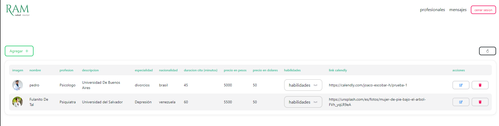

# Panel de administración para RAM salud mental.

Como parte de un beneficio de CODERHOUSE nos asignaron a mi y a 6 mas un proyecto real en donde teniamos que realizar una landing page y un panel de administración para gestionar los profesionales de la clínica.

El equipo estaba conformado por 4 diseñadores UX/UI y 3 desarrolladores REACT.

Yo me encargue de realizar el panel de administracíon

### Tecnologias:

- React JS
- Next UI - Tailwind css
- Firebase Auth
- Firestore Data Base

### demo

